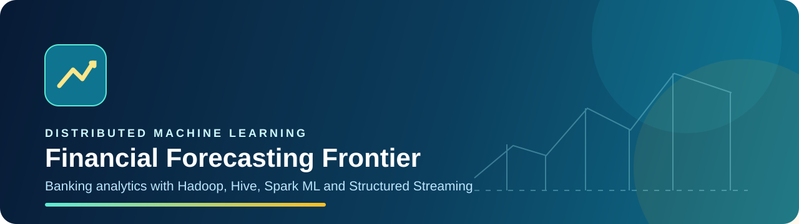
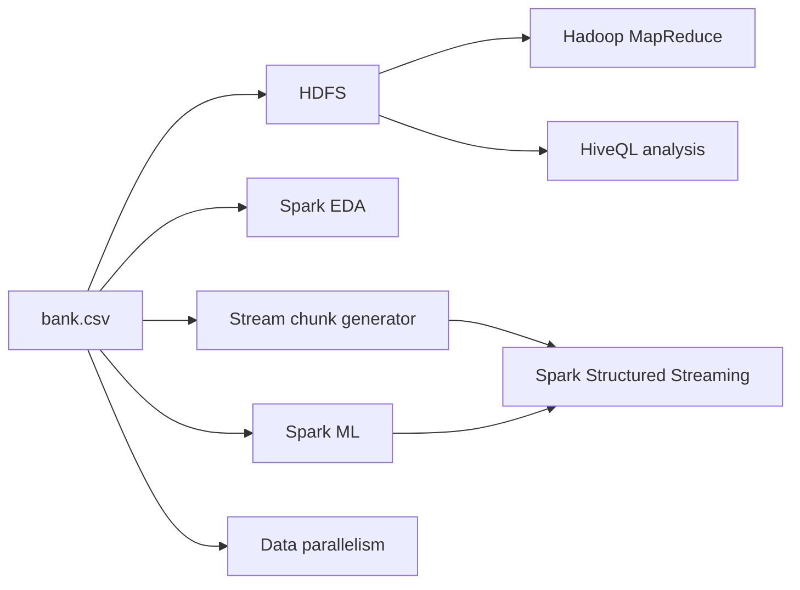

<h1 align="center">Financial Forecasting Frontier</h1>

<p align="center">
  <strong>A distributed banking analytics project using Hadoop, Hive and Apache Spark.</strong>
</p>

<p align="center">
  
  
  
  
  
</p>

## What this project does

Financial Forecasting Frontier shows how a banking dataset can move through a distributed data workflow:

- Store and process the data with Hadoop MapReduce.
- Query customer and campaign patterns with Hive.
- Explore trends with Spark DataFrames.
- Train subscription-prediction models with Spark ML.
- Simulate live transactions with Spark Structured Streaming.
- Use partitions and caching to study data parallelism.

The dataset is `bank.csv`, containing 4,521 banking marketing records. The prediction target is `y`, which shows whether a client subscribed to a term deposit.

## System flow



## Project modules

| Module | Main work | Key files |
|---|---|---|
| 🗄️ Hadoop + Hive | HDFS ingestion, five MapReduce jobs, HiveQL analysis | `hadoop/`, `hive/`, `environment/` |
| 📊 Spark EDA | Data inspection, aggregations, UDFs, correlations and charts | `spark/eda/run_eda.py` |
| 🤖 Spark ML | Feature pipeline, Logistic Regression, Decision Tree, evaluation and tuning | `spark/ml/run_ml_pipeline.py` |
| ⚡ Spark Streaming | Simulated transaction stream, live aggregations, windowing, watermarking and predictions | `spark/streaming/` |
| 🧩 Data Parallelism | Repartitioning, caching, parallel aggregation, model split and resource snapshots | `spark/parallelism/run_parallelism_analysis.py` |

## Verified findings

| Area | Result |
|---|---|
| Dataset size | 4,521 client records |
| Highest average balance by job | Retired clients: 2,319.19 |
| Highest contact month | May: 1,398 contacts; 6.65% subscription success |
| Age–balance correlation | 0.0838, a very weak positive relationship |
| Best tuned Spark ML model | Logistic Regression: accuracy 0.8941, ROC-AUC 0.8853 |
| Strongest Decision Tree feature | Contact duration: importance 0.5271 |
| Streaming window evidence | 10-second and 1-minute transaction count and average balance windows |
| Parallelism configuration | 16 partitions with cached intermediate data |

## Repository structure

```text
.
├── Financial Forecasting Frontier.ipynb  # Colab EDA and calibrated ML workflow
├── data/
│   └── raw/bank.csv
├── environment/                 # Docker Compose and WSL setup files
├── hadoop/
│   ├── mapreduce/               # Python mapper and reducer programs
│   └── run_mapreduce_jobs.sh
├── hive/
│   ├── queries/banking_analysis.hql
│   └── run_hive_queries.sh
├── spark/
│   ├── common/                  # Shared Spark helpers and schema
│   ├── eda/
│   ├── ml/
│   ├── streaming/
│   └── parallelism/
└── ops/health_checks/            # Local service checks
```

## Prerequisites

- Windows with WSL2 and Docker Desktop integration enabled.
- Docker Desktop running for the Hadoop and Hive services.
- Python 3.12 in WSL.
- Java available in WSL for PySpark.

## Setup

Clone the repository and work inside WSL:

```bash
git clone https://github.com/I-AM-PRASHANT-VERMA/almabetter-Financial-Forecasting-Frontier-Distributed-ML.git
cd almabetter-Financial-Forecasting-Frontier-Distributed-ML

python3 -m venv .venv-wsl
source .venv-wsl/bin/activate
pip install -r environment/requirements-wsl.txt
```

## Run Hadoop and Hive

Start the local Hadoop/Hive stack:

```bash
bash environment/run_hadoop_hive_stack.sh
```

Run the MapReduce jobs and HiveQL queries:

```bash
bash hadoop/run_mapreduce_jobs.sh
bash hive/run_hive_queries.sh
```

The Hadoop outputs are written under HDFS at `/project/banking/output/`. The Hive queries use the `banking_data.client_info` external table.

## Run Spark tasks

With the WSL virtual environment active:

```bash
python spark/eda/run_eda.py
python spark/ml/run_ml_pipeline.py
python spark/parallelism/run_parallelism_analysis.py
```

Generated reports, charts and model artifacts are written to `outputs/` and are intentionally excluded from Git because they can be reproduced.

## Run the streaming demo

Create fresh stream batches first:

```bash
python spark/streaming/generate_stream_chunks.py
```

Open two WSL terminals. Start the streaming application in the first terminal:

```bash
python spark/streaming/run_streaming_analysis.py
```

Then feed batches into the live input folder from the second terminal:

```bash
python spark/streaming/feed_stream.py
```

The streaming console shows job-level averages, per-transaction predictions, 10-second windows, 1-minute windows, and watermark handling for late events.

## Useful local checks

Check that the local services are reachable:

```powershell
powershell -ExecutionPolicy Bypass -File ops/health_checks/run_health_check.ps1
```

## Design choices and limitations

- `bank.csv` has a month field but no year field. Time trends are therefore reported month-wise, not year-over-year.
- `loan` is a yes/no field; the dataset does not include a numeric loan amount. For the age-group analysis, average balance of loan clients is used as the available monetary proxy.
- The Hadoop/Hive stack is local and Docker-based for reproducibility. Spark runs locally in WSL using Spark's distributed execution model.

## Submission coverage

The project includes source code for all five technical parts: Hadoop/Hive, Spark EDA, Spark ML, Spark Streaming, and Data Parallelism. The companion submission documents contain the required question-wise explanations with code and output evidence.

## Future improvements

- Run the workflow on a multi-node cloud cluster.
- Add durable checkpoints and a message broker to the streaming pipeline.
- Compare more classification models and use business-aware threshold selection.
- Add automated tests for transformations and data quality checks.

---

If this repository helped you understand the project, feel free to star it on GitHub.
